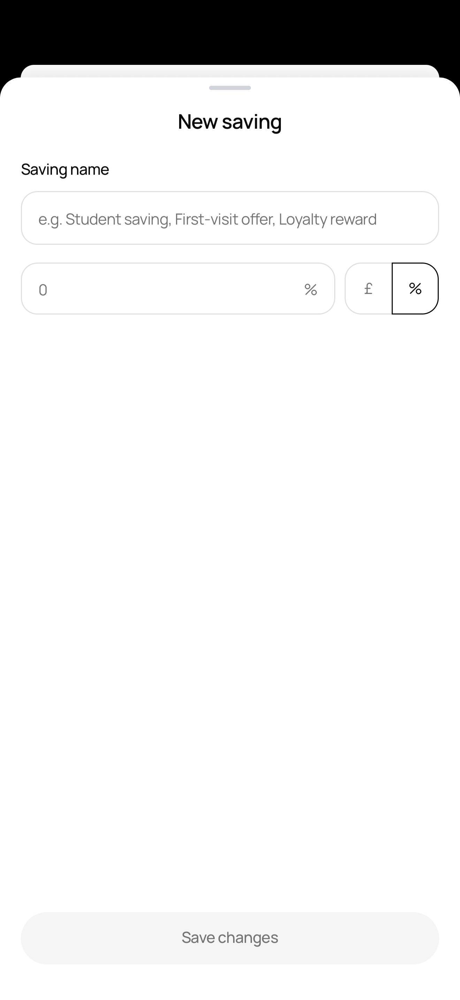
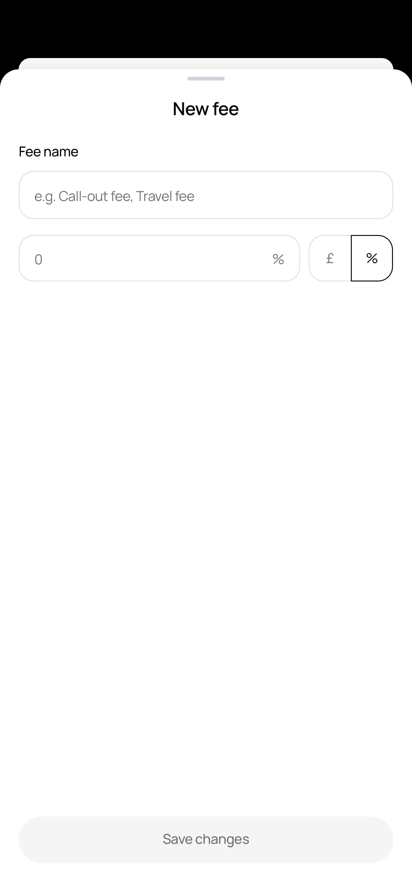

# react-native-stage-sheet

A draggable bottom sheet for **React Native & Expo** that recedes the parent screen into an iOS-style **card stack** behind it — the presenting screen scales down, rounds its corners, and dims while your sheet slides up in front.

Pure JS (no native module), so it works in **Expo Go**, dev clients, and bare React Native.

## Preview

The parent screen scales back into a rounded card behind the sheet as it slides up.

<p align="center">
  
  &nbsp;&nbsp;
  
</p>

## Features

- 🃏 iOS-style card-stack reveal — the parent screen recedes behind the sheet
- 👆 Draggable, multi-snap-point sheet with velocity-aware settling
- 📐 Safe-area-aware geometry — the parent peeks correctly under the status bar on every device
- 🎨 Fully themeable via props (no CSS/Tailwind assumptions)
- 🪶 Zero native code — Expo Go friendly

## Installation

```sh
npm install react-native-stage-sheet
```

### Peer dependencies

```sh
npx expo install react-native-reanimated react-native-gesture-handler react-native-safe-area-context
```

Then complete each library's own setup:

- **Reanimated** — add `'react-native-reanimated/plugin'` as the **last** entry in `babel.config.js`.
- **Gesture Handler** — wrap your app root in `<GestureHandlerRootView style={{ flex: 1 }}>`.
- **Safe Area** — wrap your app in `<SafeAreaProvider>`.

## Quick start

Mount the provider once, high in your tree (inside `GestureHandlerRootView` + `SafeAreaProvider`). Everything it wraps becomes the "stage" that recedes when a sheet opens.

```tsx
import { GestureHandlerRootView } from "react-native-gesture-handler";
import { SafeAreaProvider } from "react-native-safe-area-context";
import { SheetStageProvider } from "react-native-stage-sheet";

export default function App() {
  return (
    <GestureHandlerRootView style={{ flex: 1 }}>
      <SafeAreaProvider>
        <SheetStageProvider>
          {/* your navigator / screens */}
        </SheetStageProvider>
      </SafeAreaProvider>
    </GestureHandlerRootView>
  );
}
```

Present a sheet from anywhere with the `useStageSheet` hook. Snap points and content height are derived from the device automatically.

```tsx
import { Button, TextInput } from "react-native";
import { useStageSheet, StageSheet } from "react-native-stage-sheet";

function AddDiscountButton() {
  const { present } = useStageSheet();

  return (
    <Button
      title="Add discount"
      onPress={() =>
        present({
          render: ({ close, height, bottomInset }) => (
            <StageSheet
              title="Discount"
              height={height}
              bottomInset={bottomInset}
              footer={<Button title="Save" onPress={close} />}
            >
              <TextInput placeholder="Discount name" />
            </StageSheet>
          ),
        })
      }
    />
  );
}
```

That's it — the parent screen recedes into a card behind the sheet.

## API

### `<SheetStageProvider>`

Wraps the app and renders the receding stage + the active sheet.

| Prop | Type | Default | Description |
| --- | --- | --- | --- |
| `stageScale` | `number` | `0.91` | Scale the parent shrinks to when a sheet is open. |
| `stageRadius` | `number` | `14` | Corner radius of the receded parent card. |
| `stageDim` | `number` | `0.35` | Max opacity of the dim layer over the parent. |
| `backdropColor` | `string` | `"#000000"` | Colour revealed behind the receded card. |
| `stageColor` | `string` | `"#FFFFFF"` | Background of the stage itself. |
| `sheetColor` | `string` | `"#FFFFFF"` | Sheet card background. |
| `handleColor` | `string` | `"#D1D5DB"` | Drag-handle pill colour. |
| `dimColor` | `string` | `"#000000"` | Dim overlay colour. |

### `useStageSheet()`

Returns `{ present, close }`.

`present(options)`:

| Option | Type | Default | Description |
| --- | --- | --- | --- |
| `render` | `({ close, height, bottomInset }) => ReactNode` | — | Sheet content. `height`/`bottomInset` are computed for you. |
| `topGap` | `number` | `12` | Gap (pt) between the status bar and the sheet's top when open. |
| `snapPoints` | `number[]` | auto | Fractions of screen height (top → bottom). Overrides the auto value. |
| `initialSnapIndex` | `number` | `0` | Which snap point to rest at on open. |
| `springConfig` | `WithSpringConfig` | — | Reanimated spring for open/settle. |
| `velocityFactor` | `number` | `0.15` | How much fling velocity biases the target snap. |
| `onClose` | `() => void` | — | Called after the sheet fully closes. |

### `useSheetStage()`

Low-level context: `{ progress, present, close, snapToIndex }`. Use `present` directly if you want to manage snap points/height yourself; otherwise prefer `useStageSheet`.

### `<StageSheet>`

Optional, style-prop-driven body shell: centered title, content, and a footer pinned to the bottom with safe-area padding. Bring your own layout if you'd rather — the sheet renders whatever you return from `render`.

| Prop | Type | Default |
| --- | --- | --- |
| `title` | `string` | — |
| `height` | `number` | — (from `render`) |
| `bottomInset` | `number` | — (from `render`) |
| `contentGap` | `number` | `20` |
| `padding` | `number` | `20` |
| `footer` | `ReactNode` | — |
| `titleStyle` | `TextStyle` | — |
| `style` | `ViewStyle` | — |

### `<DraggableSheet>`

The underlying sheet is also exported for standalone use (with or without the stage effect) if you don't want the provider.

## How the geometry works

The receded parent is scaled about its centre, so its top edge naturally drops by `screenHeight × (1 − stageScale) / 2`. The provider subtracts exactly that from the downward shift so the card's **top edge lands right under the status bar** — the sheet then rests `topGap` points below it, letting the parent's rounded top peek through on every screen size.

## License

MIT © Okpe Onoja Godwin
